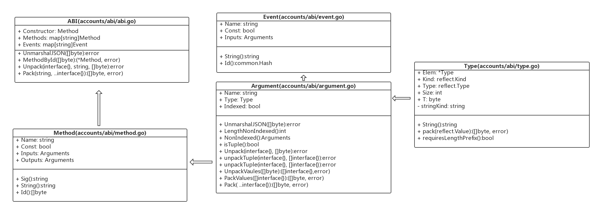

## 核心数据结构

以下介绍的代码位于`go-ethereum`项目的`accounts/abi`包。

`ABI`结构

```
type ABI struct {
   Constructor Method
   Methods     map[string]Method
   Events      map[string]Event
}
```

`Method`结构

```
type Method struct {
   Name    string    //函数名
   Const   bool      //该方法是否被constant修饰
   Inputs  Arguments 
   Outputs Arguments
}
```

> 构造函数和回调函数(callback function)没有函数名`Name`或`Outputs`。回调函数也没有`Inputs`。
>
> 下面是一个构造函数的ABI表示：
>
> {
> ​	"inputs": [],
> ​	"payable": false,
> ​	"stateMutability": "nonpayable",
> ​	"type": "constructor"
> }

`Arguments`结构

```
type Arguments []Argument
```

`Argument`结构

```
type Argument struct {
   Name    string   //形参名
   Type    Type    //形参类型
   Indexed bool // indexed is only used by events 该字段只用于事件，方法的输入没有该字段
}
```

`Type`结构

```
type Type struct {
   Elem *Type

   Kind reflect.Kind
   Type reflect.Type
   Size int
   T    byte // Our own type checking

   stringKind string // holds the unparsed string for deriving signatures
}
```

`Event`结构

```
type Event struct {
   Name      string    //事件名
   Anonymous bool      //匿名事件 or not 
   Inputs    Arguments //事件的输入参数
}
```

> 匿名事件。形如：event transfer(address indexed _from, address indexed _to, uint value) anonymous；

上述结构的UML关系图如下图。



### 获取`Method`字符串签名

```
func (method Method) Sig() string {
   types := make([]string, len(method.Inputs))
   for i, input := range method.Inputs {
      types[i] = input.Type.String()
   }
   return fmt.Sprintf("%v(%v)", method.Name, strings.Join(types, ","))
}
```

从`(method Method) Sig`方法可以看出，一个函数的返回类型不属于签名的一部分。但是我们在`ABI`的`json`描述既包含输入`input`也包含输出`output`。这也可以从`solidity`的官方文档[abi 规范部分](https://solidity.readthedocs.io/en/develop/abi-spec.html#function-selector)得到佐证。上述函数返回一个字符串。例如：我们有函数`function foo(uint32 a, int b)`，通过调用这个方法，我们得到`foo(uint32,int256)`。

> `uint`,`int`是`uint256`,`int256`的别名，根据[ABI规范](https://solidity.readthedocs.io/en/develop/abi-spec.html#types)，在计算函数选择器(selector)，即计算方法字符串签名时，得用`uint256`,`int256`。

### 计算`Method`字符串签名的ID

```
func (method Method) Id() []byte {
   return crypto.Keccak256([]byte(method.Sig()))[:4]
}
```

从`(method Method) Id`方法可以看出，方法签名的ID只取了签名字符串经过`Keccak256`取摘要后的前`4`字节。

### 获取`Method`的字符串

```
func (method Method) String() string {
   inputs := make([]string, len(method.Inputs))
   for i, input := range method.Inputs {
      inputs[i] = fmt.Sprintf("%v %v", input.Name, input.Type)
   }
   outputs := make([]string, len(method.Outputs))
   for i, output := range method.Outputs {
      if len(output.Name) > 0 {
         outputs[i] = fmt.Sprintf("%v ", output.Name)
      }
      outputs[i] += output.Type.String()
   }
   constant := ""
   if method.Const {
      constant = "constant "
   }
   return fmt.Sprintf("function %v(%v) %sreturns(%v)", method.Name, strings.Join(inputs, ", "), constant, strings.Join(outputs, ", "))
}
```

### 获取事件字符串签名及签名Id

根据[ABI规范定义](https://solidity.readthedocs.io/en/develop/abi-spec.html#events)，事件签名必须采用规范表示(canonical representation)。例如，`event log(uint indexed foo)`的事件签名字符串是`log(uint256)`。

我们来看相应的获取方法：

```
func (e Event) Id() common.Hash {
   types := make([]string, len(e.Inputs))
   i := 0
   for _, input := range e.Inputs {
      types[i] = input.Type.String()
      i++
   }
   return common.BytesToHash(crypto.Keccak256([]byte(fmt.Sprintf("%v(%v)", e.Name, strings.Join(types, ",")))))
}
```

`(e Event) Id`方法获取了事件签名字符串，并生成Id。

## 使用solc生成合约的ABI

```
solc contractname.sol --abi -o ./contractname
```

可以到etherscan.io上面找一个合约，试一下效果。这里我们不妨以`GUSD`的[合约代码](https://etherscan.io/address/0x056fd409e1d7a124bd7017459dfea2f387b6d5cd#code)来演示以下效果。执行完命令，发现生成了如下的文件：


可见GUSD的合约中每个合约类都生成了abi文件。合约地址(存有合约的字节码)和ABI是和合约互动的关键。这些以.abi作为后缀名的文件实质存的是json。

我们打开ERC20Interface.abi文件，内容如下：

```
[{"constant":false,"inputs":[{"name":"_spender","type":"address"},{"name":"_value","type":"uint256"}],"name":"approve","outputs":[{"name":"success","type":"bool"}],"payable":false,"stateMutability":"nonpayable","type":"function"},{"constant":true,"inputs":[],"name":"totalSupply","outputs":[{"name":"","type":"uint256"}],"payable":false,"stateMutability":"view","type":"function"},{"constant":false,"inputs":[{"name":"_from","type":"address"},{"name":"_to","type":"address"},{"name":"_value","type":"uint256"}],"name":"transferFrom","outputs":[{"name":"success","type":"bool"}],"payable":false,"stateMutability":"nonpayable","type":"function"},{"constant":true,"inputs":[{"name":"_owner","type":"address"}],"name":"balanceOf","outputs":[{"name":"balance","type":"uint256"}],"payable":false,"stateMutability":"view","type":"function"},{"constant":false,"inputs":[{"name":"_to","type":"address"},{"name":"_value","type":"uint256"}],"name":"transfer","outputs":[{"name":"success","type":"bool"}],"payable":false,"stateMutability":"nonpayable","type":"function"},{"constant":true,"inputs":[{"name":"_owner","type":"address"},{"name":"_spender","type":"address"}],"name":"allowance","outputs":[{"name":"remaining","type":"uint256"}],"payable":false,"stateMutability":"view","type":"function"},{"anonymous":false,"inputs":[{"indexed":true,"name":"_from","type":"address"},{"indexed":true,"name":"_to","type":"address"},{"indexed":false,"name":"_value","type":"uint256"}],"name":"Transfer","type":"event"},{"anonymous":false,"inputs":[{"indexed":true,"name":"_owner","type":"address"},{"indexed":true,"name":"_spender","type":"address"},{"indexed":false,"name":"_value","type":"uint256"}],"name":"Approval","type":"event"}]
```

这些json内容可以进一步反序列化为ABI对象。

## 进一步阅读资料

[native-dapps](https://github.com/ethereum/go-ethereum/wiki/Native-DApps:-Go-bindings-to-Ethereum-contracts)

[合约ABI spec](https://solidity.readthedocs.io/en/develop/abi-spec.html)

